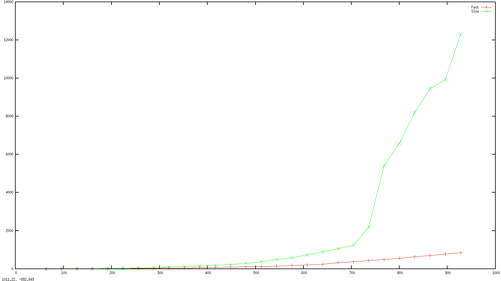

% Performance Aware Programming
% Paul Grigoras

## Last Time

* Algorithms can make a huge difference

* How about the hardware?

## This Time

* We will look at a few hardware features with a high impact on the
  performance of (some) applications:
    * caches
    * vectorization
    * branch prediction
    * multi-core

# Caches

## The Memory Hierarchy

* Our sytems are composed of cheap and slow memory
    * Magnetic tape, disks, ssds, DRAM
* Fast and expensive memory
    * L1-3 caches, CPU registers
* The performance for read/write at different levels may vary by a few
  orders of magnitude
* Hence, it is important to use our memory hierarchy well...

## Caches

* Caches are fast, but usually quite small
* Furthermore _caching_ is a fundamental technique in both hardware
  and algorithm design:
    * We saw Dynamic Programming makes use of caching
    * Almost all computers today have some form of cache

## Caches

* Generally, caches are organised in rows, each row containing one or
  more words

* In practice, the design of a cache may be quite elaborate. Things to consider:
    * Replacement policy
    * Pre-fetching
    * Associativity
    * Number of levels
    * Ensuring cache coherency between multiple processors (on
      multi-processor systems)

* However, we can do well with a simple model of the cache
    * It has R rows
    * Each row stores W words
    * The width of a word is 8 bytes
    * Initially the cache is empty
    * On a cache miss, we fetch the original address as well as the
      neighbouring W words

## Cache Example

## Caches

* reading data from cache is much faster than from memory..
* .. minimizing the number of cache misses can improve performance
* Which brings us back to...

* Modern CPUs can optimise sequential read/write access
    * Data prefetch on linear access pattern
* We should make use of this
* Improve locality (spatial and temporal)
* align code and data

## Matrix Multiply

## Matrix Multiply

## Matrix Multiply

* Important kernel in many applications
* Canonical example in compiler theroy do to the horde of
  optimisations that can be applied, (to great effect) over the naive
  version

## Matrix Multiply Naive vs Loop Interchanged

## Observing Cache Performance

## Java Native Interface
